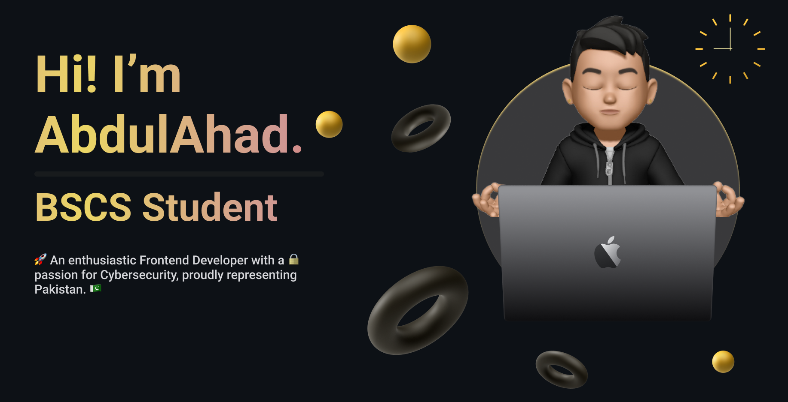

  

- 🔭 I’m currently working on **Full-Stack**
- 🌱 I’m currently learning **DevOps**
- 👨‍💻 All of my projects are available at my [Portfolio](https://ahad-devsite.netlify.app/) or [AllProjects](https://ahad324.github.io/AllProjects/)
- 💬 Ask me about **Web Dev, Cyber-Security**
- 📫 How to reach me **ahadg446@gmail.com**
- ⚡ Fun fact **I'm Cool 😎**

---

### Connect with me:

  
  

### Languages:

  

### Front-End:

  

### Back-End:

  

### Databases:

  

### Tools:

  

### OS:

  

### Hosting:

  

### Others:

  

### DevOps / Infrastructure:

  

---

  

  

  

    

---
